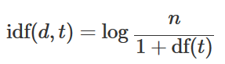
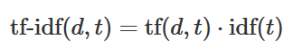

### TF-IDF encoding
- TF-IDF (Term Frequency - Inverse Document Frequency) encoding is an improved way of BOW (bag of words) which is the same as TF. It considers the frequently seen term in various documents to be less of importance.

- TF (Term Frequency): Counts how many term exists in a document
- IDF (Inverse Document Frequency): Inverse of the number of documents which contains the term 
<br>
  
- TFIDF
<br>

### Fit character n-gram tf idf vectorizer with corpus
I select char bigram (analyzer='char',ngram_range=(2,2))
```python
>>> from sklearn.feature_extraction.text import TfidfVectorizer
>>> corpus = ['banana milk', 'apple juice', 'orange juice']
>>> vectorizer = TfidfVectorizer(analyzer='char', ngram_range=(2,2)).fit(corpus)
>>>print(vectorizer.get_feature_names())

[' j', ' m', 'a ', 'an', 'ap', 'ba', 'ce', 'e ', 'ge', 'ic', 'il', 'ju', 'le', 'lk', 'mi', 'na', 'ng', 'or', 'pl', 'pp', 'ra', 'ui']
```

### Transform text to tf-idf weighted vector
```python
>>> mention = ['pineapple milk']
>>> tfidf_vector = vectorizer.transform(mention).toarray()
>>> print(tfidf_vector)

[[0.         0.34142622 0.         0.         0.34142622 0.
  0.         0.25966344 0.         0.         0.34142622 0.
  0.34142622 0.34142622 0.34142622 0.         0.         0.
  0.34142622 0.34142622 0.         0.        ]]
```