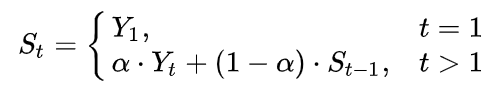

### Background
BI-DIRECTIONAL ATTENTION FLOW FOR MACHINE COMPREHENSION (Seo, ICLR 2017) 재구현 하다가 Model Details의 다음 문장이 이해가 안됐다.
> "During training, the moving averages of all weights of the model are maintained with the exponential decay rate of 0.999."

찾아보니 Exponentially weighted averages(EWA) 또는 Exponentially moving averages(EMA)라고 부르는 것이고 Andrew Ng 교수님의 [좋은 강의](https://www.youtube.com/watch?v=lAq96T8FkTw)가 있어 내용을 정리해보고자 한다. 

### Exponentially weighted averages
- Gradient Descent보다 빠른 최적화 알고리즘을 위한 개념
- 통계학에서 Exponentially weighted moving averages라고 부름
- 데이터 노이즈를 줄이기 위한 방법
- 식 (강의에서는 a 대신 1-b를 사용했다)
 
  - 상수 a는 EMA 상수로 0에서 1사이 값. a가 높을 수록 이전 time step의 값을 무시한다.
  - Yt는 해당 time step t의 값
  - St은 해당 time step t의 weighted average 반영된 값 

### Implementation (TBD)