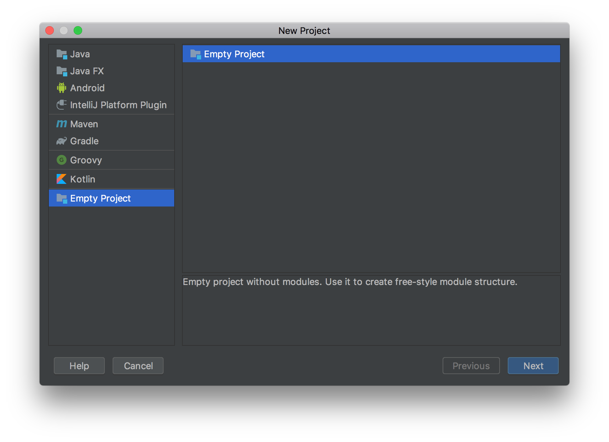
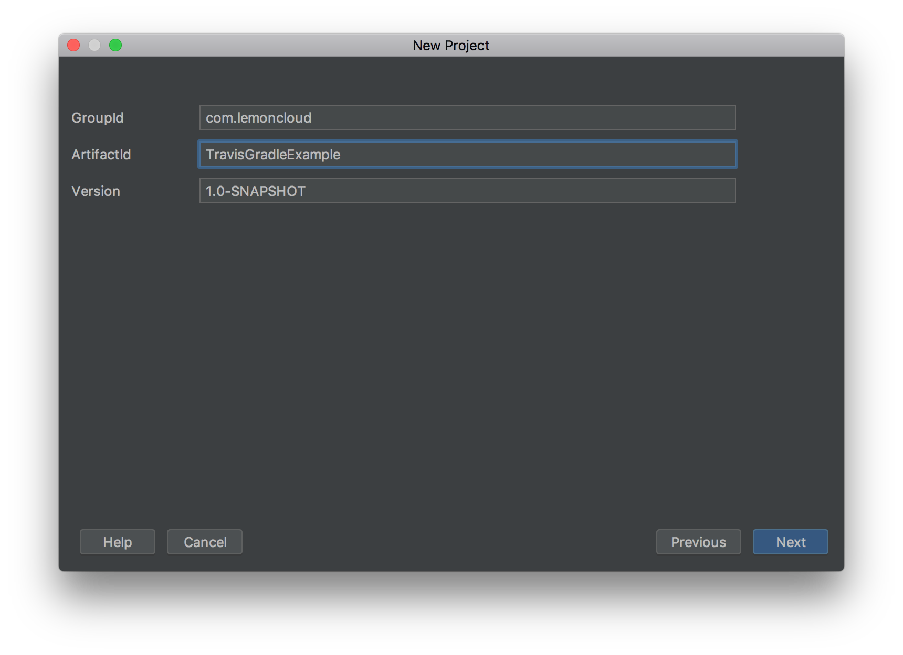
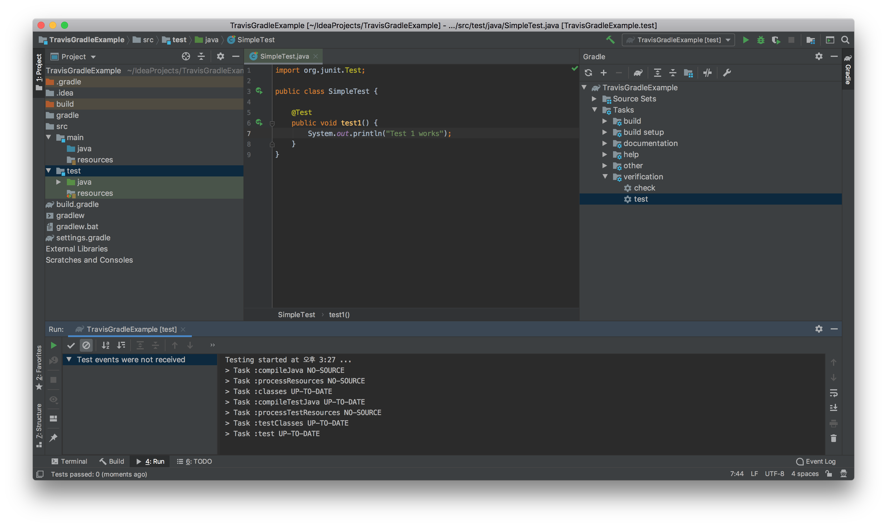
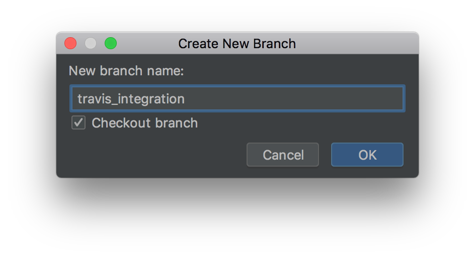

### Step 1: IntelliJ로 Gradle 프로젝트 생성하기
<br>

### Step 2: Group, Artifact ID 설정하기
<br>

### Step 3: Project 구조
- src/main/java: Java 애플리케이션 코드
- src/main/test: JUnit tests
- build.gradle: gradle build configuration file

### Step 4: test 파일 생성하기
- test 디렉토리에 SimpleTest 라는 java class를 만든다.
```java
import org.junit.Test;

public class SimpleTest {

    @Test
    public void test1() {
        System.out.println("Test 1 works");
    }
}
```

### Step 5: Gradle Test Suite 실행
- Gradle Tool Window를 켠다: View > Tool Windows > Gradle
- Test: Tasks> verification > test 더블클릭
- "All Tests Passed" 라고 뜨면 빌드가 성공한 것이다.
<br>

### Step 6: Git Repo 생성, Github에 업로드
1. VCS > Enable Version Control > Git 선택
2. VCS > Commit Changes > Unversioned Files 선택 > Commit message 작성
3. VCS > Import into Version Control > Share Project on Github
<br>

### Step 7: Travis CI 준비
- 저장소 폴더에 .travis.yml 파일 생성한다
```yml
language: java
jdk:
- oraclejdk8
```

### Step 8: 새로 생성된 Git Repo를 Travis에서 동작시킨다.

### Step 9: Fork 생성 후 github에 push한다
- VCS > Git > Branches > New branch
  
### Step 10: Pull Request를 만든다.
