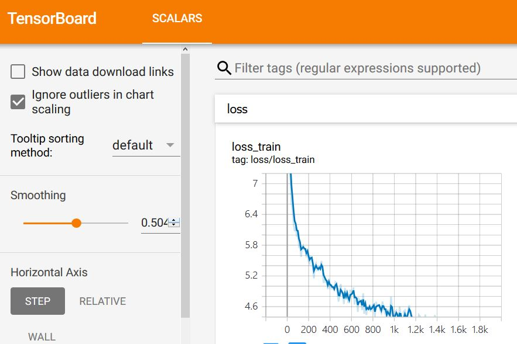

### Install tensorboardX
```bash
$ pip install tensorboardX
```

### Logging on tensorboard
```
from tensorboardX import SummaryWriter
summary = SummaryWriter()

for i, data in enumerate(train_loader)):
    ...
    if (i + 1) % 10 == 0:
        summary.add_scalar('loss/loss_train', loss.item(), i) 
    ...
```

### Execute Tensorboard
```
$ tensorboard --logdir=runs --bind_all
```
<br>