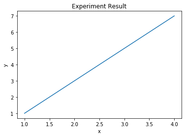

### Problem
How can you draw a graph with python?

### Solution
Use pyplot in matplotlib libary.

```python
%matplotlib inline
import matplotlib.pyplot as plt
x = [1,2,3,4]
y = [1,3,5,7]

plt.plot(x,y)
plt.xlabel('x')
plt.ylabel('y')
plt.title('Experiment Result')
plt.show()
```

### Result
